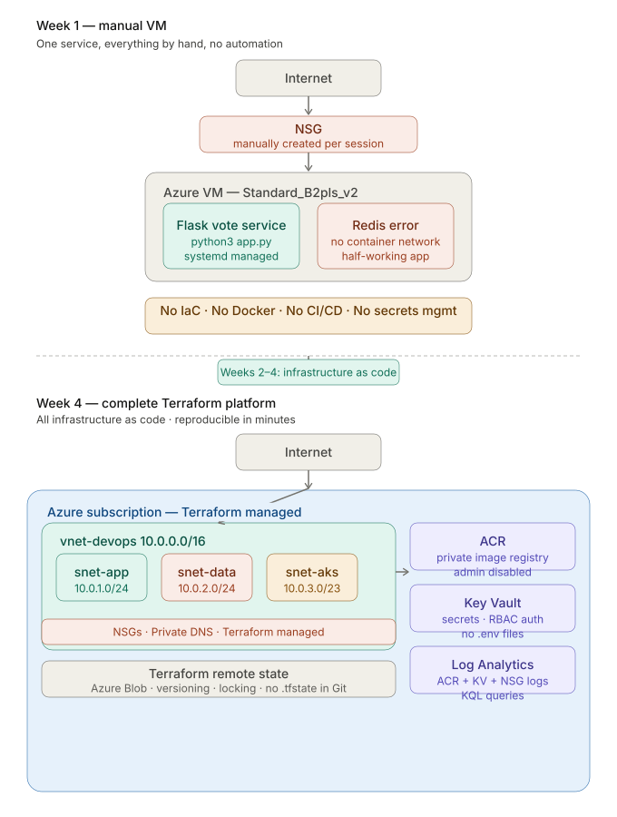

# Architecture Evolution

## Week 1 — Manual VM

The starting point. One VM, one service, everything done by hand.

### What existed
- Single VM provisioned manually via Azure CLI
- Vote service running as systemd service — python3 app.py
- NSG rules created manually per session, deleted each night
- ufw enabled inside the VM
- No automation, no reproducibility guarantee

### What was missing
- Redis, worker, result service — app only half worked
- No Docker — dependencies installed directly on OS
- No IaC — VM could not be reproduced reliably
- No CI/CD — deployment was manual SSH
- No secrets management — credentials in .env files

---

## Weeks 2–3 — Network and IaC foundation

- VNet (10.0.0.0/16) with four subnets designed from CIDR calculations
- NSGs with network segmentation — data layer unreachable from internet
- Private DNS Zone (devops-lab.internal) with auto-registration
- Private Endpoint for storage — no public access
- Azure Bastion — SSH without public IPs
- Full network stack rebuilt as Terraform — reproducible in minutes
- Remote state in Azure Blob — versioning, soft delete, locking
- Terraform modules — networking module, dev and staging environments
- Destroy-rebuild test passed — Week 3 baseline recorded

---

## Week 4 — Complete Terraform platform

### What exists
- All infrastructure managed by Terraform
- VNet, 4 subnets, NSGs, Private DNS — networking module
- ACR — private image registry, admin disabled, Managed Identity pattern
- Key Vault — secrets store, RBAC auth, no .env files
- Log Analytics Workspace — ACR and Key Vault diagnostic settings
- KQL query library — security audit, deployment audit, performance baseline
- Remote state with locking — dev and staging independent state files
- Destroy-rebuild test target: under 20 minutes

### What's missing
- Docker — app still not containerised
- Redis error still unfixed — full stack not running
- CI/CD — deployment still manual
- AKS — Kubernetes coming in Act 3

### Next — Week 5: Docker
Containerise all five voting app services. Fix the Redis error.
Run the full stack with Docker Compose. Push images to ACR with
immutable tags. The manual pain of Week 1 finally automated away.

